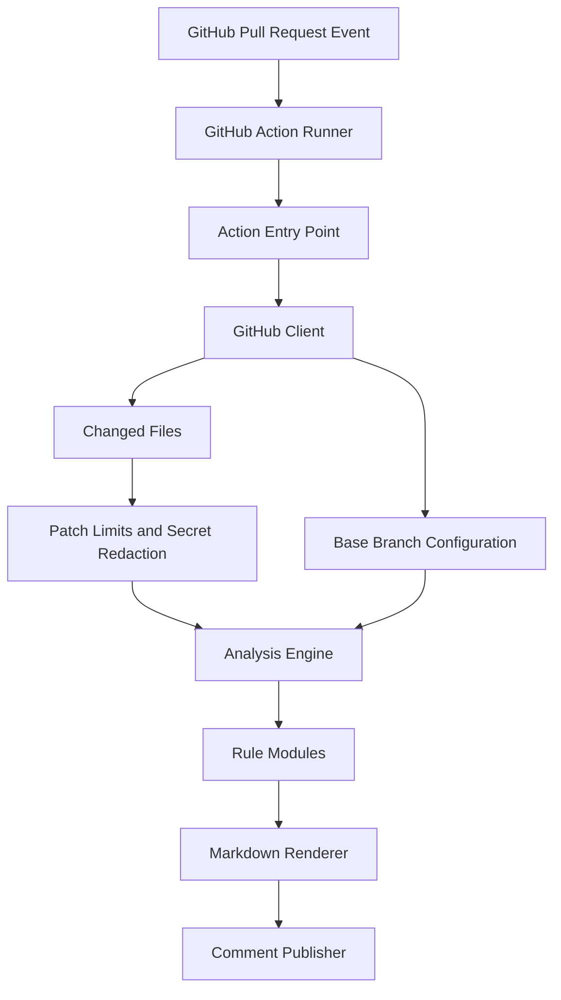

# Prism Review

Prism Review is a GitHub Action that reviews pull requests for risk signals before a human reviewer starts.

It combines deterministic, testable rules with a clean reporting layer so teams can catch missing tests, sensitive file changes, large diffs, dependency changes, and security-sensitive modifications earlier.

## Why This Exists

Human code review is expensive attention. Prism Review does not try to replace reviewers. It prepares the review by pointing out the areas that deserve extra care.

The first version is intentionally deterministic. Optional AI review can be added later as an advisory layer, but the core product remains predictable, testable, and useful without paid APIs.

## Features

- Runs on GitHub Pull Request events
- Fetches changed files through the GitHub API
- Applies configurable risk rules
- Reports credentials added in the diff, on the line where they appear, without ever printing the value
- Loads its configuration from the pull request base commit, so a PR cannot relax its own review
- Posts or updates a single PR comment, or appends one per run
- Optionally annotates findings beside the changed files, with no extra permission
- Supports local fixture-based analysis
- Includes unit tests for parsing, rules, redaction, rendering, and the GitHub client, plus an end-to-end run of the bundled action
- Ships as a self-contained bundle, so no dependency install happens on the runner
- Uses minimal GitHub permissions
- Works on GitHub Enterprise Server through the API URL the runner provides
- Avoids executing repository code or relying on broad action helper packages

## Quick Start

Create `.github/workflows/prism-review.yml`:

```yaml
name: Prism Review

on:
  pull_request:
    types: [opened, synchronize, reopened]

permissions:
  contents: read
  pull-requests: read
  issues: write

jobs:
  review:
    runs-on: ubuntu-latest
    steps:
      - uses: gabrielolvv/prism-review@v0
        with:
          github-token: ${{ secrets.GITHUB_TOKEN }}
          config-path: .prism-review.yml
```

No checkout step is needed. The action reads the pull request and its configuration through the GitHub API, so pull request code never lands on the runner.

## Local Development

```bash
npm install
npm run typecheck
npm test
npm run bundle
npm run analyze:fixture
```

`npm test` compiles into `build/`. `npm run bundle` regenerates the committed `dist/` bundles that GitHub executes, so run it before committing source changes.

## Configuration

```yaml
risk:
  largeDiff:
    maxFiles: 25
    maxChangedLines: 800

rules:
  missingTests:
    enabled: true
    sourceGlobs:
      - "src/**/*.ts"
    testGlobs:
      - "**/*.test.ts"
  sensitiveFiles:
    enabled: true
    patterns:
      - ".github/workflows/**"
      - "**/auth/**"
      - "**/migrations/**"
      - "package.json"

security:
  maxPatchBytes: 200000
  redaction:
    allowlist:
      - "^[0-9a-f]{40}$"

comment:
  mode: "upsert"
  includeLowSeverity: false

annotations:
  enabled: true
```

See [`docs/configuration.md`](docs/configuration.md) for every option.

## Architecture



## Current Rules

| Rule | Purpose |
| --- | --- |
| `large-diff` | Flags PRs that exceed file or line thresholds. |
| `missing-tests` | Flags source changes without test changes. |
| `sensitive-files` | Flags auth, permissions, CI, migration, and deployment-sensitive files. |
| `config-change` | Flags any change to the Prism Review configuration file, including adding, deleting, or renaming it. |
| `dependency-risk` | Flags dependency manifest and lockfile changes for supply-chain review. |
| `oversized-patch` | Reports files whose patch exceeded the size limit and was not inspected. |

## Example Output

Prism Review posts a pull request comment with a risk summary, findings, and a reviewer checklist. By default it updates that comment on every push; `comment.mode: append` posts a new one instead.

See [`docs/sample-review-comment.md`](docs/sample-review-comment.md) for a full example.

## Security Model

- Repository code is never executed, and no checkout is needed.
- Configuration is read from the base commit, not from the pull request.
- Pull request content is treated as untrusted input.
- The action uses minimal GitHub token permissions.
- In the default `upsert` mode, an HTML marker keeps a single bot comment instead of spamming. Comments written by people are never edited, even when they contain the marker.
- GitHub API calls use a minimal REST client with explicit request paths.
- Oversized patches are dropped before any pattern matching runs.
- Patch content is redacted before review flows can use it.
- GitHub API requests have timeouts, bounded pagination, and truncated error details.
- AI features are not part of the deterministic core.

## Roadmap

- Add prompt-injection test fixtures
- Add inline PR annotations through the Checks API
- Add OpenAI-powered advisory summaries
- Add GitHub App mode with queue-based processing
- Add dashboard for organization-level risk trends

See [`docs/roadmap.md`](docs/roadmap.md) for details and shipped items.

## License

[MIT](LICENSE)
