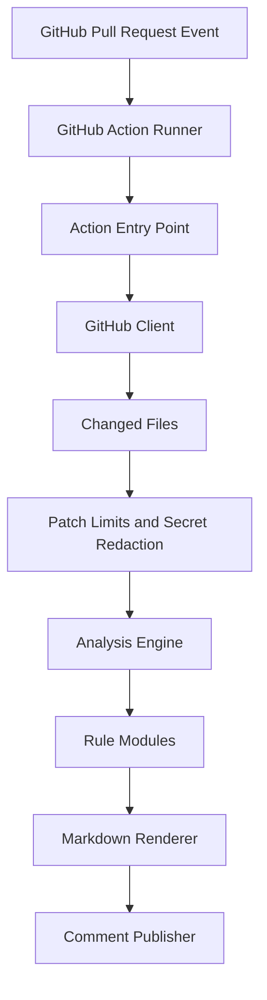

# Prism Review

Prism Review is a GitHub Action that reviews pull requests for risk signals before a human reviewer starts.

It combines deterministic, testable rules with a clean reporting layer so teams can catch missing tests, sensitive file changes, large diffs, dependency changes, and security-sensitive modifications earlier.

## Why This Exists

Human code review is expensive attention. Prism Review does not try to replace reviewers. It prepares the review by pointing out the areas that deserve extra care.

The first version is intentionally deterministic. Optional AI review can be added later as an advisory layer, but the core product remains predictable, testable, and useful without paid APIs.

## Features

- Runs on GitHub Pull Request events
- Fetches changed files through the GitHub API
- Applies configurable risk rules
- Posts or updates a single PR comment
- Supports local fixture-based analysis
- Includes unit tests for parsing, rules, redaction, rendering, and the GitHub client
- Ships as a self-contained bundle, so no dependency install happens on the runner
- Uses minimal GitHub permissions
- Avoids executing repository code or relying on broad action helper packages

## Quick Start

Create `.github/workflows/prism-review.yml`:

```yaml
name: Prism Review

on:
  pull_request:
    types: [opened, synchronize, reopened]

permissions:
  contents: read
  pull-requests: read
  issues: write

jobs:
  review:
    runs-on: ubuntu-latest
    steps:
      - uses: actions/checkout@v4
      - uses: gabrielolvv/prism-review@v0
        with:
          github-token: ${{ secrets.GITHUB_TOKEN }}
          config-path: .prism-review.yml
```

## Local Development

```bash
npm install
npm run typecheck
npm test
npm run bundle
npm run analyze:fixture
```

`npm test` compiles into `build/`. `npm run bundle` regenerates the committed `dist/` bundles that GitHub executes, so run it before committing source changes.

## Configuration

```yaml
risk:
  largeDiff:
    maxFiles: 25
    maxChangedLines: 800

rules:
  missingTests:
    enabled: true
    sourceGlobs:
      - "src/**/*.ts"
    testGlobs:
      - "**/*.test.ts"
  sensitiveFiles:
    enabled: true
    patterns:
      - ".github/workflows/**"
      - "**/auth/**"
      - "**/migrations/**"
      - "package.json"

security:
  maxPatchBytes: 200000
  redaction:
    allowlist:
      - "^[0-9a-f]{40}$"

comment:
  mode: "upsert"
  includeLowSeverity: false
```

See [`docs/configuration.md`](docs/configuration.md) for every option.

## Architecture



## Current Rules

| Rule | Purpose |
| --- | --- |
| `large-diff` | Flags PRs that exceed file or line thresholds. |
| `missing-tests` | Flags source changes without test changes. |
| `sensitive-files` | Flags auth, permissions, CI, migration, and deployment-sensitive files. |
| `dependency-risk` | Flags dependency manifest and lockfile changes for supply-chain review. |
| `oversized-patch` | Reports files whose patch exceeded the size limit and was not inspected. |

## Example Output

Prism Review posts one upserted pull request comment with a risk summary, findings, and a reviewer checklist.

See [`docs/sample-review-comment.md`](docs/sample-review-comment.md) for a full example.

## Security Model

- Repository code is never executed.
- Pull request content is treated as untrusted input.
- The action uses minimal GitHub token permissions.
- Comment publishing uses an HTML marker to update the existing bot comment instead of spamming.
- GitHub API calls use a minimal REST client with explicit request paths.
- Oversized patches are dropped before any pattern matching runs.
- Patch content is redacted before review flows can use it.
- GitHub API requests have timeouts, bounded pagination, and truncated error details.
- AI features are not part of the deterministic core.

## Roadmap

- Add prompt-injection test fixtures
- Add inline PR annotations through the Checks API
- Add OpenAI-powered advisory summaries
- Add GitHub App mode with queue-based processing
- Add dashboard for organization-level risk trends

See [`docs/roadmap.md`](docs/roadmap.md) for details and shipped items.

## License

MIT
